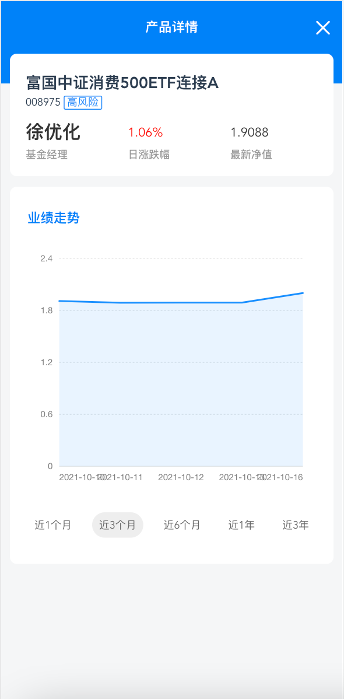
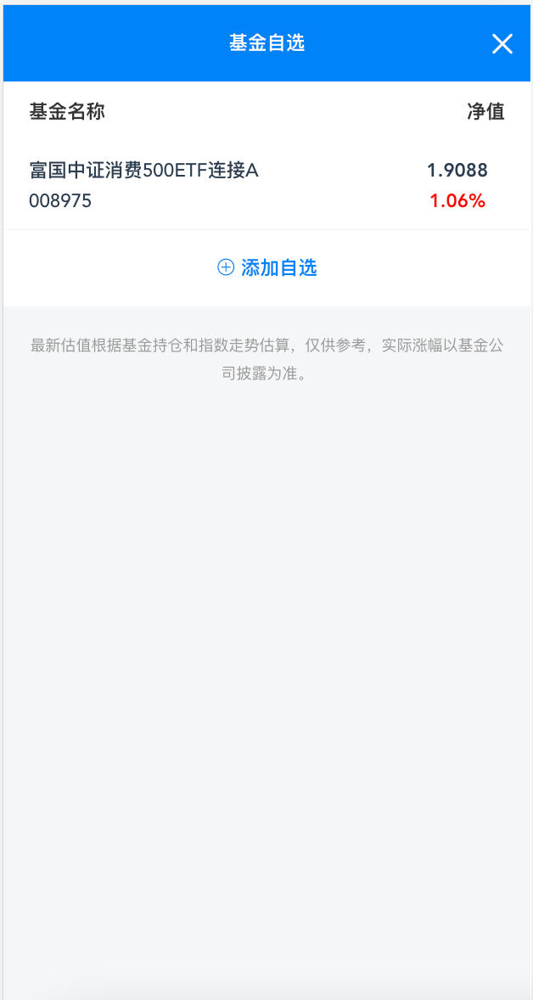
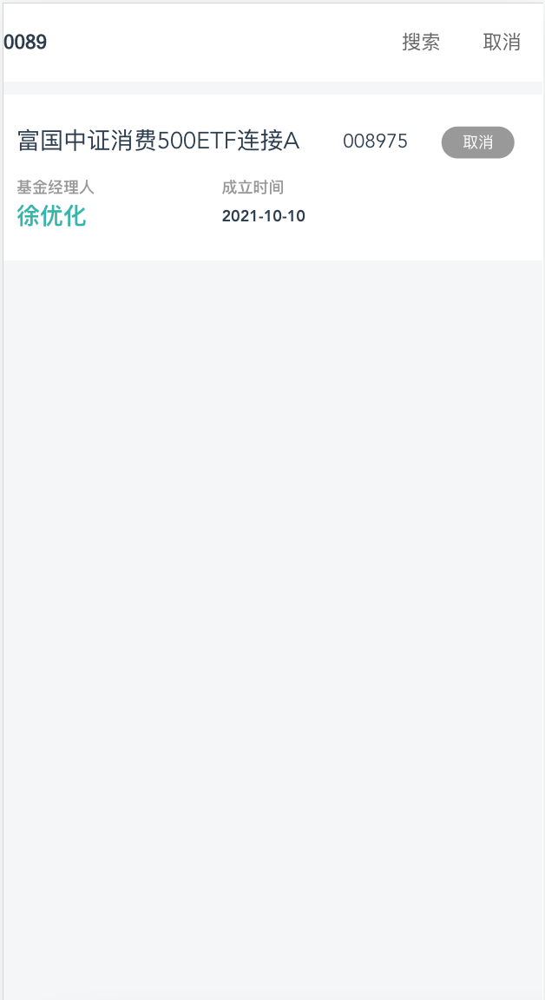
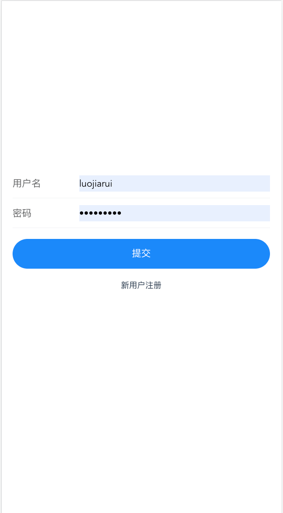
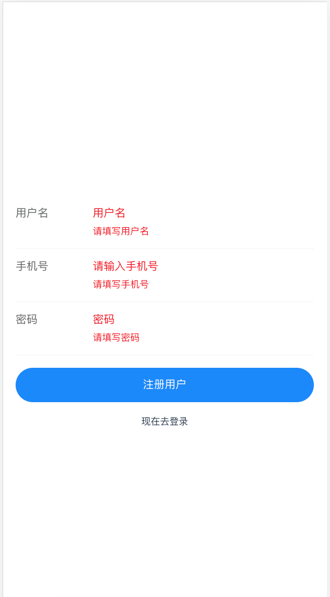

## 1  前言

模仿支付宝的界面，使用vue+springboot编写基金自选系统。

使用到的组件包括：

-   后端组件： SpringBoot 2.4.1, Mysql 8.0.24, Swagger, Mybatis-plus；
-   后端组件：Vue 2.6， Axios， AntV， md5。


#### 2  基金自选功能

1、用户登录

2、新用户注册，相同用户名不可重复注册

3、查询所有基金

4、添加我关注的基金

5、移除我关注的基金

6、基金信息详情展示

7、基金历史净值查询


#### 3  其他功能

1、任何除登录以外的请求都作是否已经登录认证的校验；

2、保存在数据库的用户密码密文保存；

3、后端对每个请求做必要输入校验，如对递交上来的手机号码做是否符合手机号码特征的校验；

4、后端使用swagger开放API文档；

5、后端使用日志切面记录每个请求和响应的报文体。

### 4 其他特性

① 注册、登录页表单元素要做格式和非空校验；

② 每个页面数据加载和交互请求有 交互提示；

③ 按钮操作需要有防重复点击控制；

④ axios请求做统一封装，处理登录会话状态；

⑤ 图表展示使用antV框架















## 5 使用方法

### 5.2 后端模块使用方法

-   导入数据库，找到后端项目中，db文件夹的sql文件，将sql文件导入到数据库中。

```
# import database 
mysql -u[user like root] -p[123456] < db/*.sql

```

>   数据库中的数据需要自行准备

-   启动程序

```
mvn clean

mvn install

```

-   查看API接口

````shell
### Swagger地址: 启动项目，访问如下地址
```
http://localhost:8088/swagger-ui/index.html#/
```
````


### 5.2 前端模块使用方法

````shell
## Project setup
```
npm install
```

### Compiles and hot-reloads for development
```
npm run serve
```

### Compiles and minifies for production
```
npm run build
```
````